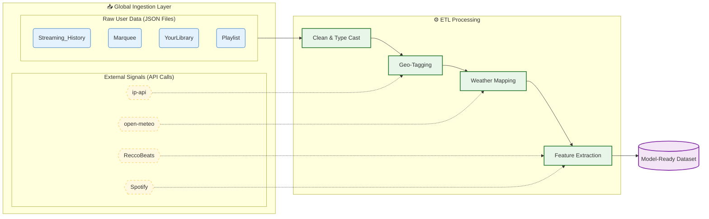

# Context Aware Music Recommendation Engine

---

## 📄 Overview
This Python project utilizes **Jupyter Notebooks** and **pandas** to unify multiple JSON data exports into a comprehensive single dataset. A key feature of this project is the integration of historical weather data corresponding to the user's location at the time of listening.

By analyzing your specific listening history and environmental context, the program builds a machine learning model to:
1.  **Predict the next song** in a sequence.
2.  Provide **personalized recommendations** based entirely on tracks you have already heard and enjoy.

---

## 👥 Authors

This project was developed by a team of **Data Analyst** students from **Instituto J&F**. Each member is currently completing an **internship** within their respective companies under the J&F Group:

* **Bruno Guedes Galvão** – Data Analyst Intern, JBS USA
* **Gabriel Teixeira Ferreira** – Data Analyst Intern, JBS Matriz
* **Lucas Cazorla Laurente** – Data Analyst Intern, JBS USA
* **Sophia Dedini Ragusa** – Data Analyst Intern, Seara Matriz
* **Sophia Laurindo Gasparetto** – Data Analyst Intern, JBS USA

---

## 🚀 Key Features
* **Data Unification:** Merges fragmented JSON exports into a clean Pandas DataFrame.
* **Weather Context:** Enriches listening data with weather metrics (temperature, condition) based on location and timestamp.

---

## 🛠️ Tech Stack
* **Language:** Python 3.13.2
* **Data Manipulation:** Pandas, json
* **Environment:** Jupyter Notebooks
* **Data Formats:** JSON, DataFrame

---

## 🔄 Data Pipeline Architecture
The following diagram illustrates how raw user data and external APIs are processed to create the final training dataset.

---

## 📊 Data Catalog

This catalog is built from a **unified master dataset** synthesized from multiple disparate sources. By performing **schema alignment** and **normalization**, we merged these various data streams into a single, cohesive source of truth optimized for model training.

> **Note:** The data types, column names, and schemas listed below are subject to change as the project evolves and the model is refined.

| NAME | LEGACY_NAME | TYPE | DESCRIPTION | EXAMPLE | ORIGIN |
| :--- | :--- | :--- | :--- | :--- | :--- |
| `TS` | `ts` | string | UTC timestamp when the playback event occurred (ISO 8601). | 2025-03-11T08:12:26Z | Streaming_History_Audio_YYYYY-YYYY.json |
| `MS_PLAYED` | `ms_played` | int | Milliseconds the track was played in the session. | 69528 | Streaming_History_Audio_YYYYY-YYYY.json |
| `COUNTRY` | `conn_country` | string | Country code of the user connection at play time. | BR | Streaming_History_Audio_YYYYY-YYYY.json |
| `NAME` | `master_metadata_track_name` | string | Track name from master metadata. | TWENTIES | Streaming_History_Audio_YYYYY-YYYY.json |
| `ARTIST_NAME` | `master_metadata_album_artist_name` | string | Primary artist name from album metadata. | GIVĒON | Streaming_History_Audio_YYYYY-YYYY.json |
| `ALBUM_NAME` | `master_metadata_album_album_name` | string | Album name from metadata. | TWENTIES | Streaming_History_Audio_YYYYY-YYYY.json |
| `URI` | `spotify_track_uri` | string | Spotify URI that uniquely identifies the track. | spotify:track:1NaSrCqTnZdlusQ82SJhGN | Streaming_History_Audio_YYYYY-YYYY.json |
| `REASON_START` | `reason_start` | string | Reason playback started (button, autoplay, etc.). | backbtn | Streaming_History_Audio_YYYYY-YYYY.json |
| `REASON_END` | `reason_end` | string | Reason playback stopped or changed. | unexpected-exit-while-paused | Streaming_History_Audio_YYYYY-YYYY.json |
| `SHUFFLE` | `shuffle` | boolean | Whether shuffle mode was enabled. | true | Streaming_History_Audio_YYYYY-YYYY.json |
| `SKIPPED` | `skipped` | boolean | Whether the track was skipped before completion. | false | Streaming_History_Audio_YYYYY-YYYY.json |
| `OFFLINE` | `offline` | boolean | Whether playback happened in offline mode. | false | Streaming_History_Audio_YYYYY-YYYY.json |
| `INCOGNITO_MODE` | `incognito_mode` | boolean | Whether private/incognito listening mode was active. | false | Streaming_History_Audio_YYYYY-YYYY.json |
| `SEGMENT` | `segment` | string | Listener segment classification label. | Light listeners | Marquee.json |
| `IS_SAVED_SONG` | `is_saved_song` | boolean | Calculated flag indicating if the track is saved in the user library. | true | YourLibrary.json |
| `PLAYLIST_INCLUSIONS_COUNT` | `playlist_inclusions_count` | int | Calculated count of playlists that include the track. | 53 | Playlist.json |
| `TEMPERATURE` | `temperature` | float | Air temperature measured at the given time and location, in degrees Celsius. | 20.058 | open-meteo |
| `PRECIPITATION` | `precipitation` | float | Total precipitation (rain/snow) recorded for the time interval, in millimeters. | 0.0 | open-meteo |
| `POPULARITY` | `popularity` | int | Popularity score based on stream counts (1–100). | 87 | ReccoBeats – Get multiple track |
| `ACOUSTICNESS` | `acousticness` | float | Likelihood the track is acoustic vs electronic (0–1). | 0.72 | ReccoBeats – Get multiple audio features |
| `DANCEABILITY` | `danceability` | float | How suitable the track is for dancing based on rhythm and tempo (0–1). | 0.81 | ReccoBeats – Get multiple audio features |
| `ENERGY` | `energy` | float | Overall intensity and activity level of the track (0–1). | 0.64 | ReccoBeats – Get multiple audio features |
| `INSTRUMENTALNESS` | `instrumentalness` | float | Probability the track has no vocals (closer to 1 = instrumental). | 0.93 | ReccoBeats – Get multiple audio features |
| `KEY` | `key` | int | Musical key using pitch class notation (0=C … 11=B, -1 unknown). | 5 | ReccoBeats – Get multiple audio features |
| `MODE` | `mode` | int | Key modality: major = 1, minor = 0. | 1 | ReccoBeats – Get multiple audio features |
| `LIVENESS` | `liveness` | float | Probability the track was recorded live (0–1). | 0.12 | ReccoBeats – Get multiple audio features |
| `LOUDNESS` | `loudness` | float | Average loudness in decibels (typically -60 to 0 dB). | -7.3 | ReccoBeats – Get multiple audio features |
| `SPEECHINESS` | `speechiness` | float | Amount of spoken words vs singing/music (0–1). | 0.21 | ReccoBeats – Get multiple audio features |
| `TEMPO` | `tempo` | float | Estimated tempo in BPM. | 128.4 | ReccoBeats – Get multiple audio features |
| `VALENCE` | `valence` | float | Musical mood from sad (0) to happy (1). | 0.76 | ReccoBeats – Get multiple audio features |
| `DURATION_MS` | `duration_ms` | int | Track length in milliseconds. | 215000 | Spotify API – Get track |
| `EXPLICIT` | `explicit` | boolean | Whether the track has explicit lyrics. | false | Spotify API – Get track |